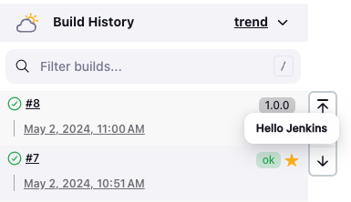
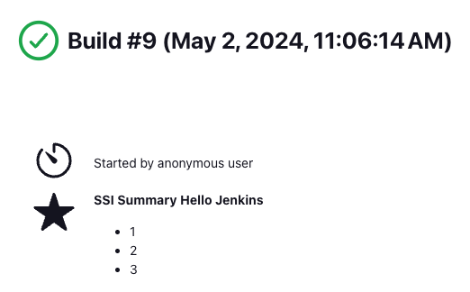

# Badge plugin

Jenkins plugin to add badges and build summary entries from a pipeline.

This plugin was forked from the [Groovy Postbuild Plugin](https://plugins.jenkins.io/groovy-postbuild) which will in future use the API from this plugin.

## addBadge

This method allows to add build badge icons.



```groovy

// puts a badge with the given icon and text.

// addBadge
// ------------------------------------------

/**
 * minimal params
 *
 * icon: The icon for this badge
 * text: The text for this badge
 */
addBadge(icon: <icon>, text: <text>)

/**
 * all params
 *
 * icon: The icon for this badge
 * text: The text for this badge
 * color: (optional) The Jenkins palette/semantic color name or CSS color of the badge icon symbol
 * id: (optional) Badge identifier. Selectively delete badges by id.
 * link: (optional) The link to be added to this badge
 */
addBadge(icon: <icon>, text: <text>, color: <color>,
         id: <id>, link: <link>)


// addInfoBadge
// ------------------------------------------

/**
 * minimal params
 *
 * text: The info text for this badge
 */
addInfoBadge(text: <text>)

/**
 * all params
 *
 * text: The info text for this badge
 * id: (optional) Badge identifier. Selectively delete badges by id.
 * link: (optional) The link to be added to this badge
 */
addInfoBadge(text: <text>, id: <id>, link: <link>)


// addWarningBadge
// ------------------------------------------

/**
 * minimal params
 *
 * text: The text for this warning badge
 */
addWarningBadge(text: <text>)

/**
 * all params
 *
 * text: The text for this warning badge
 * id: (optional) Badge identifier. Selectively delete badges by id.
 * link: (optional) The link to be added to this badge
 */
addWarningBadge(text: <text>, id: <id>, link: <link>)


// addErrorBadge
// ------------------------------------------

/**
 * minimal params
 *
 * text: The text for this error badge
 */
addErrorBadge(text: <text>)

/**
 * all params
 *
 * text: The text for this error badge
 * id: (optional) Badge identifier. Selectively delete badges by id.
 * link: (optional) The link to be added to this badge
 */
addErrorBadge(text: <text>, id: <id>, link: <link>)

```

## removeBadges

Removes badges

```groovy

// removes badges. If no id is provided all are removed.
// If an id is provided, remove badges with the matching id.

// removeBadges
// ------------------------------------------

/**
 * minimal params
 *
 */
removeBadges()

/**
 * all params
 *
 * id: (optional) Badge identifier. Selectively delete badges by id.
 */
removeBadges(id: <id>)

```

## addHtmlBadge

Puts a badge with custom html

```groovy

// puts a badge with a custom html content.
// addHtmlBadge
// ------------------------------------------

/**
 * minimal params
 *
 * html: The html content to be used for this badge
 */
addHtmlBadge(html: <html>)

/**
 * all params
 *
 * html: The html content to be used for this badge
 * id: (optional) Badge identifier. Selectively delete badges by id.
 */
addHtmlBadge(html: <html>, id: <id>)

```
## removeHtmlBadges

Removes html badges

```groovy

// removes html badges. If no id is provided all are removed.
// If an id is provided, remove badges with the matching id.

// removeHtmlBadges
// ------------------------------------------

/**
 * minimal params
 *
 */
removeHtmlBadges()

/**
 * all params
 *
 * id: (optional) Badge identifier. Selectively delete badges by id.
 */
removeHtmlBadges(id: <id>)
 ```

## addShortText

Puts a badge with a short text

```groovy

// puts a badge with a short text, using the default format.
// For Colors supported, Google "html color names".

// addShortText
// ------------------------------------------

/**
 * minimal params
 *
 * text: The text to add fot this badge
 */
addShortText(text: <text>)

/**
 * all params
 *
 * text: The text to add fot this badge
 * background: (optional) The background-color for this short text
 * border: (optional) The border width for this short text
 * borderColor: (optional) The order color for this short text
 * color: (optional) The color for this short text
 * link: (optional) The link for this short text
 */
addShortText(text: <text>, background: <background>,
             border: <border>, borderColor: <borderColor>,
             color: <color>, link: <link>)

```

## createSummary

Puts a badge with a short text



```groovy

// creates an entry in the build summary page and returns a summary
// object corresponding to this entry. The icon must be one of the 48x48
// icons offered.

// createSummary
// ------------------------------------------

/**
 * minimal params
 *
 * icon: The icon for this summary
 */
createSummary(icon: <icon>)

/**
 * all params
 *
 * icon: The icon for this summary
 * id: (optional) Badge identifier. Selectively delete badges by id.
 * text: (optional) The title text for this summary
 */
createSummary(icon: <icon>, id: <id>, text: <text>)


def summary = createSummary(icon)
summary.appendText(text, escapeHtml)
summary.appendText(text, escapeHtml, bold, italic, color)
```

## removeSummaries

Removes summaries

```groovy

// removes summaries. If no id is provided all are removed.
// If an id is provided, remove badges with the matching id.

// removeSummaries
// ------------------------------------------

/**
 * minimal params
 *
 */
removeSummaries()

/**
 * all params
 *
 * id: (optional) Badge identifier. Selectively delete badges by id.
 */
removeSummaries(id: <id>)

```

## Icons

Icons can reference [Jenkins Symbols](https://weekly.ci.jenkins.io/design-library/Symbols/), including [ionicons](https://ionic.io/ionicons).
View the complete list of all symbols provided by the ionicons-api-plugin on https://ionic.io/ionicons .

```groovy
addBadge(icon: 'symbol-star')
```

In addition to the default [16x16](https://github.com/jenkinsci/jenkins/tree/master/war/src/main/webapp/images/16x16) icons offered by Jenkins, badge plugin provides the following icons:

-  completed.gif
-  db_in.gif
-  db_out.gif
-  delete.gif
-  error.gif
-  folder.gif
-  green.gif
-  info.gif
-  red.gif
-  save.gif
-  success.gif
-  text.gif
-  warning.gif
-  yellow.gif

### Other plugin icons

Other plugin icons can be used by setting the path of the icon within the jenkins context. Don't forget the leading '/'.

```groovy
addBadge(icon: "/static/8361d0d6/images/16x16/help.png", text: "help")
```

## Colors

Colors may reference [Jenkins palette colors or variables](https://weekly.ci.jenkins.io/design-library/Colors/).

```groovy
# jenkins palette colors
addBadge(icon: 'symbol-star', color: 'yellow')
addBadge(icon: 'symbol-star', color: 'dark-yellow')
addBadge(icon: 'symbol-star', color: 'var(--yellow)')
addBadge(icon: 'symbol-star', color: 'jenkins-!-color-yellow')

# jenkins semantic colors
addBadge(icon: 'symbol-star', color: 'warning')
addBadge(icon: 'symbol-star', color: 'success')

# css colors
addBadge(icon: 'symbol-star', color: '#ffff00')
addBadge(icon: 'symbol-star', color: 'rgb(239, 245, 66)')
```

## Allow HTML in Badge and Summary

The badge plugin uses by default the OWASP Markup Formatter to sanitize the HTML Badge and Summary. This feature can be disabled in the Jenkins configuration:
Manage Jenkins -> Configure System -> Badge Plugin


